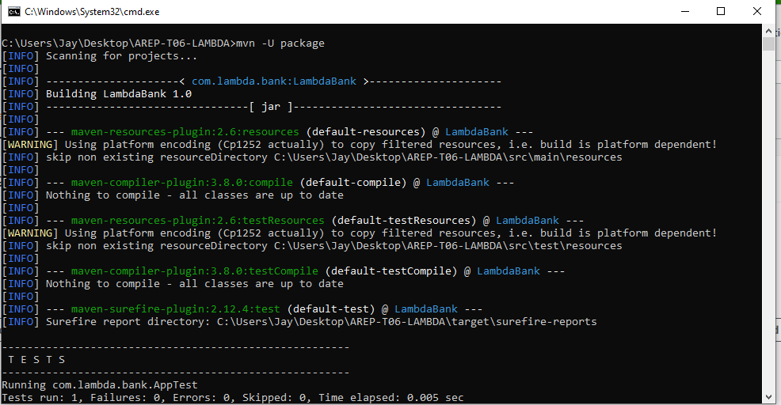

# AREP-T06-LAMBDA

### Presentado por:
Jeisson G. Sanchez Ramos

### Configuracion de funcion lambda

Creamos la funcion

Compilamos el codigo para generar el jar con dependencias

Subimos el jar

Configuramos la funcion a ejecutar

Creamos una prueba

Ejecutamos la prueba

